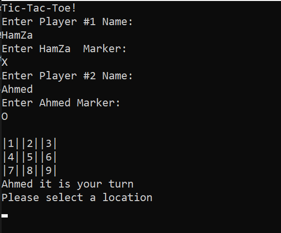
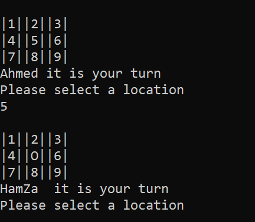
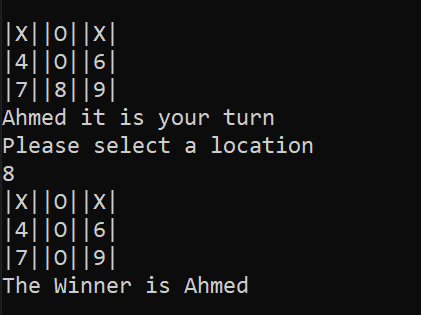
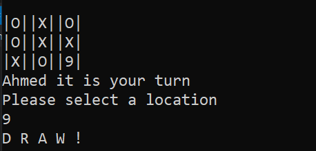

# Tic-Tac-Toe Game!

*HamZa Samha*

#### Tic-tac-toe, noughts and crosses, or Xs and Os is a paper-and-pencil game for two players who take turns marking the spaces in a three-by-three grid with X or O. The player who succeeds in placing three of their marks in a horizontal, vertical, or diagonal row is the winner. 

*This project is a visualization for tic tac toe game*

## Walkthrough

### start 

- Enter Player 2 Name and Marker *(Ex: Ahmed, O)*.
- Enter Player 1 Name and Marker *(Ex: HamZa, X)*.
- And it will start the game with **Player 2** turn.

### Select Location

- **Player 2** pick the '5' cell.
- Then its **Player 1** turn.
- And repeat the steps.

### Winner 

- Winner

### Draw 

- Draw

